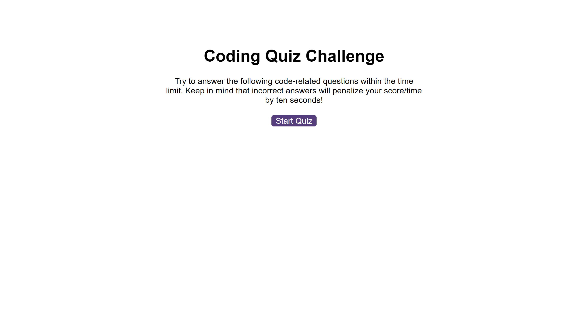
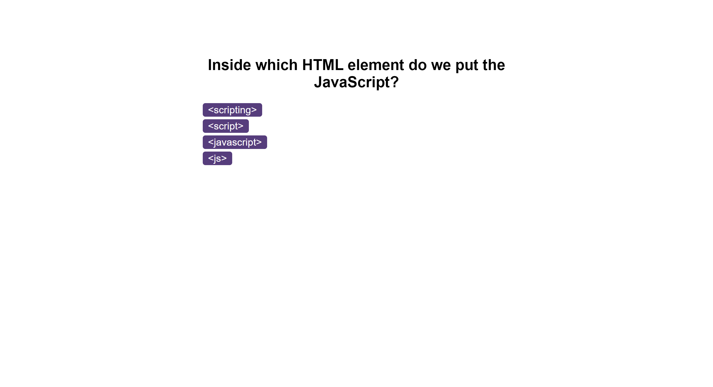
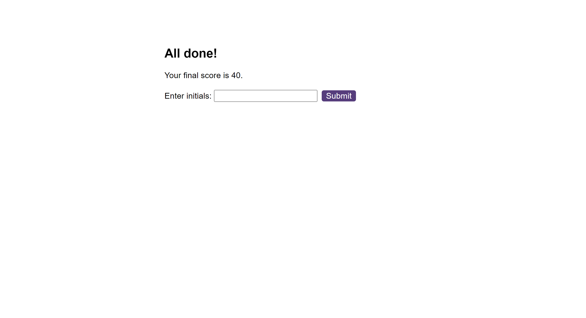
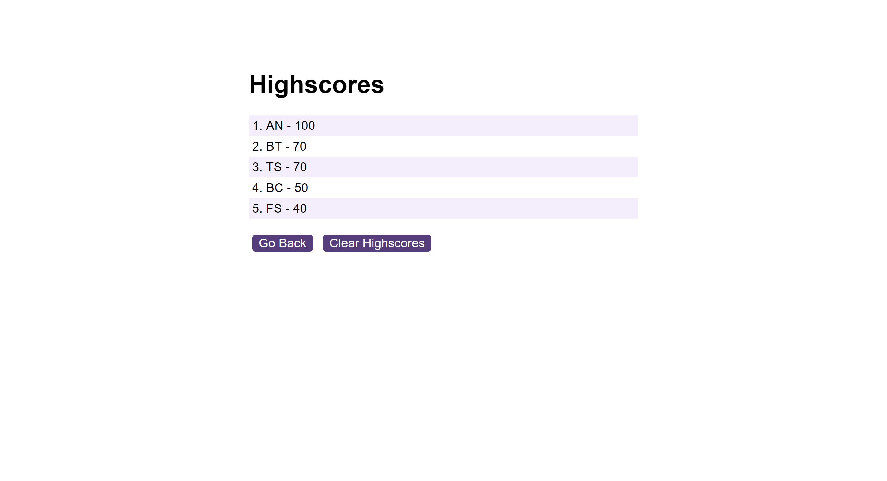

# Code Quiz Game

## Description
This project is a timed quiz game. Users can test their knowledge of HTML, CSS and JavaScript, by answering 10 multiple-choice questions. The available time is 100 seconds, and after each correct answer users get 10 points, however if the answer is incorrect, 10 seconds will be deducted from the remaining time. Once the timer reaches 0, or all questions are answered, users can send their initials with their score, and it will be locally stored on a highscores board.

## How to play
1. Click on the "Start Quiz" button.
2. In the upper-right corned the timer starts to count down and the first question appears.
3. Once the question is answered, a feedback message and a sound effect informs the player if their answer is correct or wrong.
4. After a 2 seconds delay, the next question appers.
5. Once the timer reaches 0, or all questions are answered, end of game screan appears, showing the player's score with the possibility to store it with their initials.
6. After submitting their score, the highscores board appears. User can clear the board by clicking the "Clear Highscores" button, or they can play again by clicking the "Go Back" button.

## Screenshots

## Links
[Link to the deployed application](https://nyitrai87.github.io/code-quiz/)

## Sources
- I copied questions and answers from the following W3School quiz: [JavaScript Quiz Test](https://www.w3schools.com/js/js_quiz.asp)
- To be able to play a sound when a question is answered, used Shantanu Jana's tutorial on dev.to: [How to Play Sound on Button Click in JavaScript](https://dev.to/shantanu_jana/how-to-play-sound-on-button-click-in-javascript-3m48)
- To be able to render the questions properly, I have got hints from my friend, Attila Gyongyosi. Please see his beautiful GitHub profile: [Attila Gyongyosi](https://github.com/attilagyongyosi)